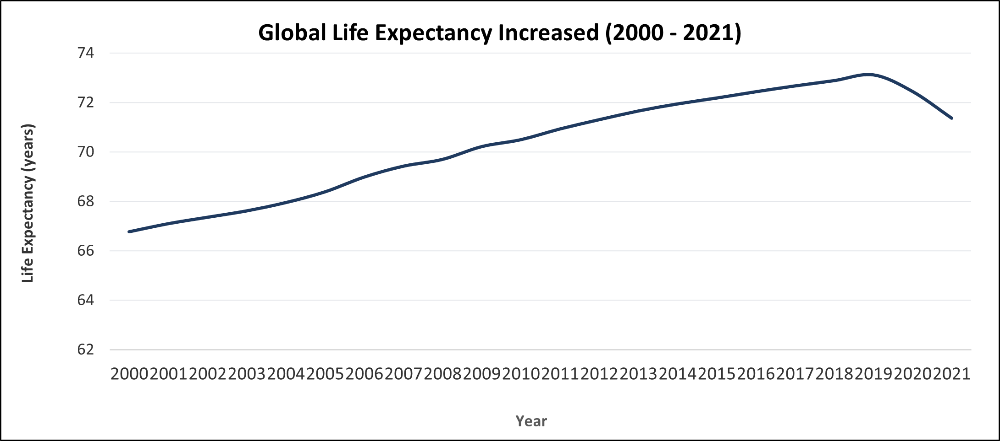
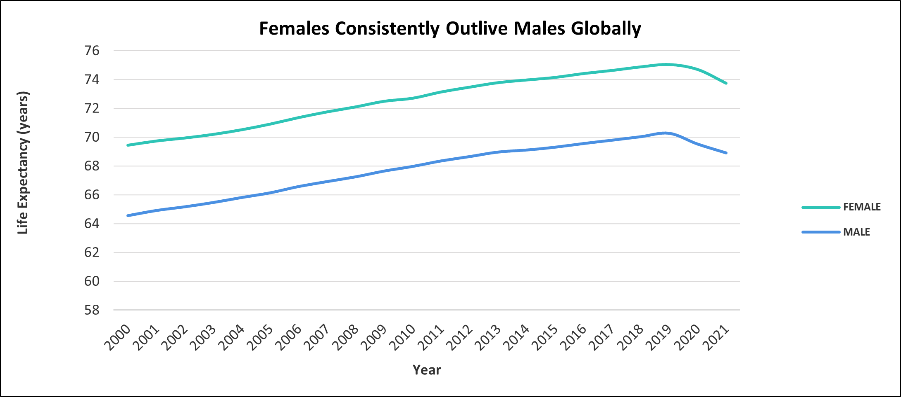
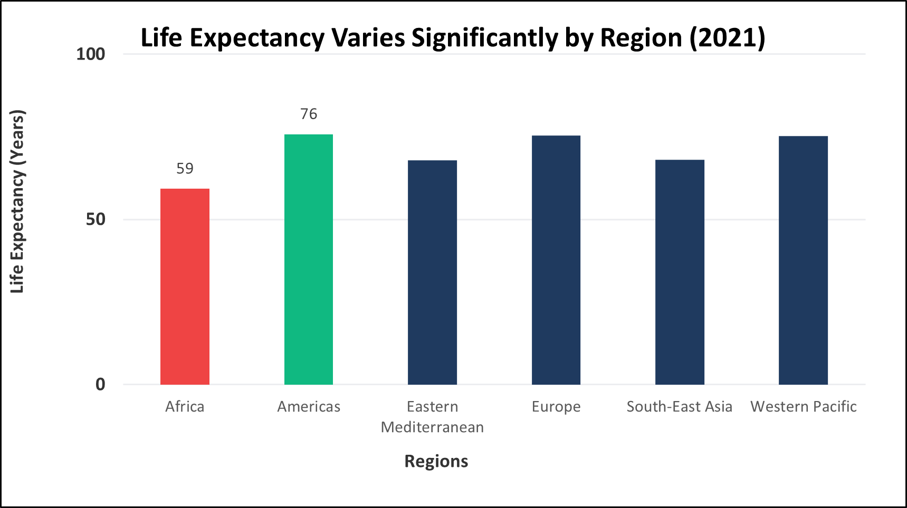
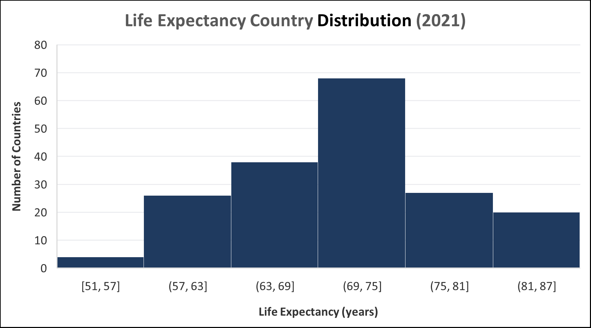

# Global Life Expectancy Analysis (2000–2021)

This project explores global life expectancy trends using Excel.  
The goal is to understand how life expectancy has changed over time, and how it differs across gender and regions.

---

## Problem Statement

Understanding life expectancy trends helps reveal global health progress and inequalities across populations.  
This analysis focuses on identifying patterns over time and differences between demographic groups.

---

## Dataset Overview

- Source: Life Expectancy at Birth dataset (WHO-style)
- Time Period: 2000–2021  
- Levels:
  - Global
  - WHO Regions
  - Countries  
- Key Metric:
  - `AMOUNT_N` → Life expectancy (years)

---

## Tools Used

- Microsoft Excel  
- Pivot Tables  
- Line Charts, Bar Charts, Histogram  

---

## Data Preparation

The following steps were performed:

- Filtered dataset to include only `PUBLISHED` records  
- Focused on:
  - Global trends
  - Regional comparisons
  - Country-level distribution  
- Used `AMOUNT_N` as the primary measure  
- Built Pivot Tables for aggregation and analysis  

---

## Key Questions

1. How has global life expectancy changed from 2000 to 2021?  
2. What differences exist between male and female life expectancy?  
3. Which regions have the highest and lowest life expectancy?  

---

## Analysis & Visualizations

### 1. Global Life Expectancy Trend

- Life expectancy shows a steady increase over time  
- Minor fluctuations appear towards recent years  

---

### 2. Male vs Female Life Expectancy

- Females consistently have higher life expectancy than males  
- The gap remains relatively stable over time  

---

### 3. Regional Comparison

- Significant differences exist between regions  
- Some regions outperform others by a wide margin  

---

### 4. Country Distribution

- Life expectancy varies widely across countries  
- Distribution highlights both high and low extremes  

---

## Key Insights

- Global life expectancy has generally improved over the last two decades  
- A consistent gender gap exists, with females living longer  
- Regional disparities indicate unequal access to healthcare and living conditions  
- Some regions remain significantly below global averages  

---

## Limitations

- Data is limited to 2000–2021  
- No causal variables (e.g., income, healthcare access) included  
- Country-level variation may not be fully represented  

---

## Conclusion

While global life expectancy has improved, disparities across regions and genders remain significant.  
This highlights the importance of targeted health interventions and policy improvements.

---

## Files Included

- Excel analysis file  
- Dataset (CSV)  
- Exported charts  
- Summary report (PDF)  

---

## Next Steps

- Build an interactive dashboard (Power BI)  
- Add more variables (GDP, healthcare spending)  
- Perform deeper statistical analysis  
